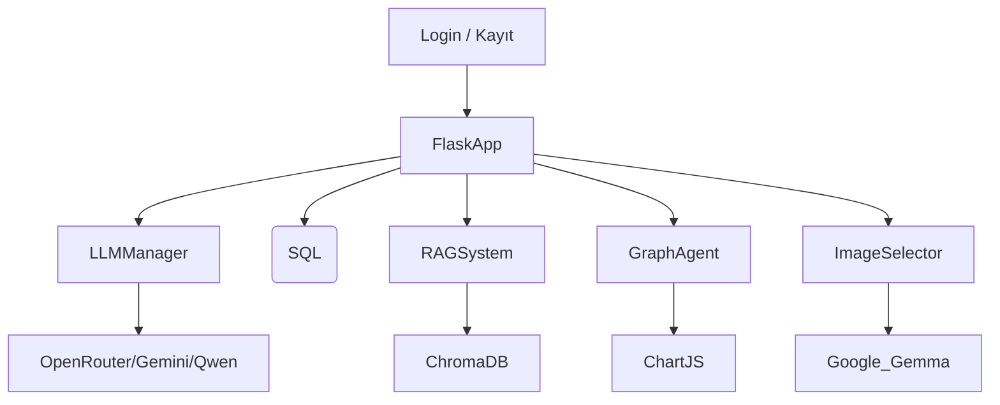

# 🤖 HR Assistant

Yapay zekâ destekli İnsan Kaynakları asistanı. HR Assistant, doğal dil işleme (LLM), belge sorgulama (RAG), grafik analiz ve SQL veri erişimi gibi modern teknolojilerle desteklenen, Flask tabanlı modüler bir çözümdür.

---

## 📌 Proje Özeti

Bu proje, **LangChain framework**'ü ve modern **yapay zekâ araçları** kullanılarak geliştirilmiştir. Sistem içerisinde iki adet özel agent bulunmaktadır:

### 🧠 SQL Asistanı
- Doğal dil anlayışı sayesinde kullanıcıdan gelen metin komutları yorumlanır.
- SQL kodu üretmez, bunun yerine önceden tanımlanmış güvenli LangChain Tool fonksiyonlarını çağırır.
- Kullanıcıdan kod yazması beklenmez.
- `LangChain tools` yapısı ile entegre çalışarak, veritabanı üzerinde işlem yapılmasını sağlar, prompt analizleri burada gerçekleşir.
- Veritabanı güvenliği korunur, dış müdahalelere ve yanlış sorgulara karşı sistem izole edilmiştir.

### 📄 Döküman Asistanı
- PDF gibi belgelerdeki metinleri çıkarır ve ChromaDB üzerine kaydeder.
- İçerikte görsel varsa, bu görseller üzerindeki yazılar OCR ile okunarak işlenir.
- Gelişmiş bir görsel eşleştirme mekanizmasıyla, prompt'a en uygun görsel seçilir.
- Grafik gerektiren analizlerde, döküman içindeki verilerle **otomatik grafik önerisi** ve **Chart.js uyumlu veri üretimi** yapılır.

---

## 🚀 Özellikler

- 🔐 **Kullanıcı ve Rol Tabanlı Giriş**
- 💬 **Doğal Dil ile SQL Sorgulama (LangChain Agent)**
- 📄 **PDF/Belge Tabanlı RAG Sistemi (OCR destekli)**
- 🧠 **Model Yönetimi (OpenRouter, Gemini, Qwen)**
- 📈 **Belge Analizi ile Otomatik Grafik Oluşturma (Chart.js uyumlu)**
- 🖼️ **Görsel Analizi & Eşleştirme (Gemma + SentenceTransformer)**

---

## 🧱 Sistem Mimarisi



---

## 🧰 Kullanılan Teknolojiler

| Bileşen | Açıklama |
|--------|----------|
| **Flask** | REST API tabanı |
| **LangChain** | LLM aracı çerçevesi |
| **ChromaDB** | Vektör veritabanı (RAG için) |
| **Tesseract OCR** | Görselden metin çıkarma |
| **KimiVL** | Görsel açıklayıcı (OpenRouter modeli) |
| **Chart.js** | Grafik çizimi (Frontend) |
| **PostgreSQL** | SQL veritabanı |

---

## 🔧 Kurulum

```bash
git clone https://github.com/kullanici_adi/hr-assistant.git
cd hr-assistant
python -m venv venv
source venv/bin/activate  # Windows: venv\Scripts\activate
pip install -r requirements.txt
```

`.env` dosyanızı oluşturun:

```ini
OPENROUTER_API_KEY=your_api_key
OPENROUTER_API_BASE=https://openrouter.ai/api/v1
DB_HOST=localhost
DB_NAME=hr_db
DB_USERNAME=postgres
DB_PASSWORD=yourpassword
```

Docker ve ArgoCD kurulumları için `Dockerfile` ve `k8s/` dizini kullanılır.

---

---

## 📁 Dosya Yapısı

```bash
├── app.py                  # Flask uygulaması giriş
├── main.py                 # Ana başlatıcı
├── llm_manager.py          # Model yöneticisi
├── agent.py                # SQL Agent
├── read_rag.py             # RAG sistemi
├── graph_agent.py          # Grafik destekli analiz
├── image_selector.py       # Görsel analiz
├── gemma.py                # gemma görsel LLM bağlantısı
├── user_database.py        # Kullanıcı yönetimi
├── auth_database.py        # Rol erişim yönetimi
├── templates/              # HTML sayfaları
└── static/images/          # İşlenen görseller
```
---
☸️ Kubernetes Deployment Yapılandırmaları
Bu proje, Flask backend ve PostgreSQL veritabanı bileşenlerini kapsayan tam bir Kubernetes altyapısıyla dağıtılır. Aşağıda her YAML dosyasının işlevi açıklanmıştır:

flask-deployment.yaml
Flask tabanlı HR Assistant uygulamasını dağıtan deployment tanımıdır.

Image tag’i CI/CD pipeline tarafından otomatik güncellenir.

Pod replikası, kaynak sınırları gibi ayarlar burada yapılır.

flask-service.yaml
Flask uygulamasını Kubernetes servis objesi olarak dış dünyaya açar.

Genellikle NodePort veya LoadBalancer tipiyle yapılandırılır.

postgres-deployment.yaml
PostgreSQL veritabanı için deployment tanımıdır.

Kalıcı veriler için volume kullanımı desteklenir.

postgres-pvc.yaml
PostgreSQL için PersistentVolumeClaim tanımıdır.

Veritabanı verilerinin container yeniden başlasa dahi korunmasını sağlar.

postgres-service.yaml
PostgreSQL’e iç ağda erişimi sağlar.

Flask uygulaması bu servis ismini kullanarak veritabanına bağlanır (örneğin postgres-service.default.svc.cluster.local).

---

## 🧑‍💻 Geliştirici
**Görkem [@gorkem03](https://github.com/gorkem03)**

