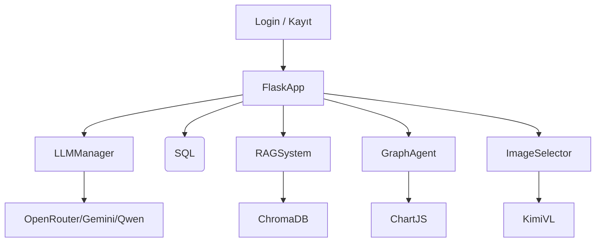

# 🤖 HR Assistant

Yapay zekâ destekli İnsan Kaynakları asistanı. HR Assistant, doğal dil işleme (LLM), belge sorgulama (RAG), grafik analiz ve SQL veri erişimi gibi modern teknolojilerle desteklenen, Flask tabanlı modüler bir çözümdür.

---

## 📌 Proje Özeti

Bu proje, **LangChain framework**'ü ve modern **yapay zekâ araçları** kullanılarak geliştirilmiştir. Sistem içerisinde iki adet özel agent bulunmaktadır:

### 🧠 SQL Asistanı
- Doğal dil prompt'ları üzerinden doğrudan SQL sorguları oluşturur.
- Kullanıcıdan kod yazması beklenmez.
- `LangChain tools` yapısı ile entegre çalışarak, veritabanı üzerinde işlem yapılmasını sağlar.

### 📄 Döküman Asistanı
- PDF gibi belgelerdeki metinleri çıkarır ve ChromaDB üzerine kaydeder.
- İçerikte görsel varsa, bu görseller üzerindeki yazılar OCR ile okunarak işlenir.
- Gelişmiş bir görsel eşleştirme mekanizmasıyla, prompt'a en uygun görsel seçilir.
- Grafik gerektiren analizlerde, döküman içindeki verilerle **otomatik grafik önerisi** ve **Chart.js uyumlu veri üretimi** yapılır.

---

## 🚀 Özellikler

- 🔐 **Kullanıcı ve Rol Tabanlı Giriş**
- 💬 **Doğal Dil ile SQL Sorgulama (LangChain Agent)**
- 📄 **PDF/Belge Tabanlı RAG Sistemi (OCR destekli)**
- 🧠 **Model Yönetimi (OpenRouter, Gemini, Qwen)**
- 📈 **Belge Analizi ile Otomatik Grafik Oluşturma (Chart.js uyumlu)**
- 🖼️ **Görsel Analizi & Eşleştirme (KimiVL + SentenceTransformer)**

---

## 🧱 Sistem Mimarisi



---

## 🧰 Kullanılan Teknolojiler

| Bileşen | Açıklama |
|--------|----------|
| **Flask** | REST API tabanı |
| **LangChain** | LLM aracı çerçevesi |
| **ChromaDB** | Vektör veritabanı (RAG için) |
| **Tesseract OCR** | Görselden metin çıkarma |
| **KimiVL** | Görsel açıklayıcı (OpenRouter modeli) |
| **Chart.js** | Grafik çizimi (Frontend) |
| **PostgreSQL** | SQL veritabanı |

---

## 🔧 Kurulum

```bash
git clone https://github.com/kullanici_adi/hr-assistant.git
cd hr-assistant
python -m venv venv
source venv/bin/activate  # Windows: venv\Scripts\activate
pip install -r requirements.txt
```

`.env` dosyanızı oluşturun:

```ini
OPENROUTER_API_KEY=your_api_key
OPENROUTER_API_BASE=https://openrouter.ai/api/v1
DB_HOST=localhost
DB_NAME=hr_db
DB_USERNAME=postgres
DB_PASSWORD=yourpassword
```

Docker ve ArgoCD kurulumları için `Dockerfile` ve `k8s/` dizini kullanılır.

---

## 📌 Kullanım

### ✅ Login
Kullanıcı adı ve şifreyle giriş yapılır, rol doğrulaması yapılır.

### 🗃️ SQL Agent
Doğal dil ile SQL sorguları oluşturulur ve veritabanına sorgu atılır.

### 📄 Belge Sorgulama (RAG)
Yüklenen PDF dosyası OCR ile işlenir, vektör veritabanına eklenir ve QA zinciriyle sorgulanır.

### 📊 Grafik Analizi
Belgeden sayısal veri çıkarılır, uygun grafik tipi belirlenir, JSON formatta veri Chart.js'e iletilir.

### 🖼️ Görsel Analizi
Sayfa içeriğindeki tablolar/grafikler görsel olarak tespit edilir ve analiz edilebilir.

---

## 📁 Dosya Yapısı

```bash
├── app.py                  # Flask uygulaması giriş
├── main.py                 # Ana başlatıcı
├── llm_manager.py          # Model yöneticisi
├── agent.py                # SQL Agent
├── read_rag.py             # RAG sistemi
├── graph_agent.py          # Grafik destekli analiz
├── image_selector.py       # Görsel analiz
├── kimi_vl_wrapper.py      # Kimi görsel LLM bağlantısı
├── user_database.py        # Kullanıcı yönetimi
├── auth_database.py        # Rol erişim yönetimi
├── templates/              # HTML sayfaları
└── static/images/          # İşlenen görseller
```

---

## 📬 Katkıda Bulunmak
Pull request'ler ve issue'lar memnuniyetle karşılanır! Yeni analiz araçları, görsel modeller veya model destekleri eklemek için katkı sunabilirsiniz.

---

## 📜 Lisans
MIT License

---

## 🧑‍💻 Geliştirici
**Görkem [@gorkem03](https://github.com/gorkem03)**

HR süreçlerini yapay zekâ ile birleştiren bu projeyle ilgili geri bildirim ve sorularınız için GitHub üzerinden iletişime geçebilirsiniz.
