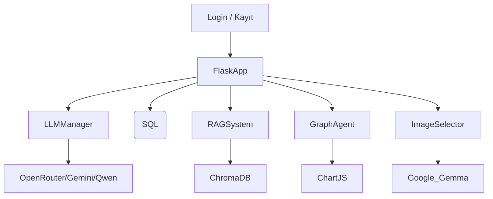

# 🤖 HR Assistant

Yapay zekâ destekli İnsan Kaynakları asistanı. HR Assistant, doğal dil işleme (LLM), belge sorgulama (RAG), grafik analiz ve SQL veri erişimi gibi modern teknolojilerle desteklenen, Flask tabanlı modüler bir çözümdür.

---
[Upload<mxfile host="app.diagrams.net" agent="Mozilla/5.0 (Windows NT 10.0; Win64; x64) AppleWebKit/537.36 (KHTML, like Gecko) Chrome/138.0.0.0 Safari/537.36" version="27.0.6">
  <diagram name="Sayfa -1" id="njU_2WFNKXbZqlTlwaeO">
    <mxGraphModel dx="1042" dy="534" grid="1" gridSize="10" guides="1" tooltips="1" connect="1" arrows="1" fold="1" page="1" pageScale="1" pageWidth="827" pageHeight="1169" math="0" shadow="0">
      <root>
        <mxCell id="0" />
        <mxCell id="1" parent="0" />
        <mxCell id="xVYwRF4Wph0S5wrf_9XY-18" value="" style="edgeStyle=orthogonalEdgeStyle;rounded=0;orthogonalLoop=1;jettySize=auto;html=1;" edge="1" parent="1" source="xVYwRF4Wph0S5wrf_9XY-2" target="xVYwRF4Wph0S5wrf_9XY-6">
          <mxGeometry relative="1" as="geometry" />
        </mxCell>
        <mxCell id="xVYwRF4Wph0S5wrf_9XY-2" value="Kafka Topic" style="strokeWidth=2;html=1;shape=mxgraph.flowchart.database;whiteSpace=wrap;" vertex="1" parent="1">
          <mxGeometry x="430" y="265" width="80" height="70" as="geometry" />
        </mxCell>
        <mxCell id="xVYwRF4Wph0S5wrf_9XY-13" style="edgeStyle=orthogonalEdgeStyle;rounded=0;orthogonalLoop=1;jettySize=auto;html=1;entryX=0;entryY=0.5;entryDx=0;entryDy=0;" edge="1" parent="1" source="xVYwRF4Wph0S5wrf_9XY-3" target="xVYwRF4Wph0S5wrf_9XY-4">
          <mxGeometry relative="1" as="geometry" />
        </mxCell>
        <mxCell id="xVYwRF4Wph0S5wrf_9XY-3" value="" style="rounded=1;whiteSpace=wrap;html=1;" vertex="1" parent="1">
          <mxGeometry x="120" y="270" width="120" height="60" as="geometry" />
        </mxCell>
        <mxCell id="xVYwRF4Wph0S5wrf_9XY-17" value="" style="edgeStyle=orthogonalEdgeStyle;rounded=0;orthogonalLoop=1;jettySize=auto;html=1;" edge="1" parent="1" source="xVYwRF4Wph0S5wrf_9XY-4" target="xVYwRF4Wph0S5wrf_9XY-2">
          <mxGeometry relative="1" as="geometry" />
        </mxCell>
        <mxCell id="xVYwRF4Wph0S5wrf_9XY-4" value="Producer.py" style="rounded=1;whiteSpace=wrap;html=1;" vertex="1" parent="1">
          <mxGeometry x="280" y="270" width="120" height="60" as="geometry" />
        </mxCell>
        <mxCell id="xVYwRF4Wph0S5wrf_9XY-5" value="Send Order" style="rounded=1;whiteSpace=wrap;html=1;" vertex="1" parent="1">
          <mxGeometry x="690" y="270" width="120" height="60" as="geometry" />
        </mxCell>
        <mxCell id="xVYwRF4Wph0S5wrf_9XY-19" value="" style="edgeStyle=orthogonalEdgeStyle;rounded=0;orthogonalLoop=1;jettySize=auto;html=1;" edge="1" parent="1" source="xVYwRF4Wph0S5wrf_9XY-6" target="xVYwRF4Wph0S5wrf_9XY-5">
          <mxGeometry relative="1" as="geometry" />
        </mxCell>
        <mxCell id="xVYwRF4Wph0S5wrf_9XY-6" value="strateji.py" style="rounded=1;whiteSpace=wrap;html=1;" vertex="1" parent="1">
          <mxGeometry x="540" y="270" width="120" height="60" as="geometry" />
        </mxCell>
        <mxCell id="xVYwRF4Wph0S5wrf_9XY-7" value="" style="ellipse;shape=cloud;whiteSpace=wrap;html=1;" vertex="1" parent="1">
          <mxGeometry x="110" y="110" width="120" height="80" as="geometry" />
        </mxCell>
        <mxCell id="xVYwRF4Wph0S5wrf_9XY-12" style="edgeStyle=orthogonalEdgeStyle;rounded=0;orthogonalLoop=1;jettySize=auto;html=1;entryX=0.5;entryY=0;entryDx=0;entryDy=0;" edge="1" parent="1" source="xVYwRF4Wph0S5wrf_9XY-10" target="xVYwRF4Wph0S5wrf_9XY-3">
          <mxGeometry relative="1" as="geometry" />
        </mxCell>
        <mxCell id="xVYwRF4Wph0S5wrf_9XY-10" value="BINANCE API" style="text;html=1;align=center;verticalAlign=middle;resizable=0;points=[];autosize=1;strokeColor=none;fillColor=none;" vertex="1" parent="1">
          <mxGeometry x="130" y="190" width="100" height="30" as="geometry" />
        </mxCell>
        <mxCell id="xVYwRF4Wph0S5wrf_9XY-14" value="BTC PRICE" style="text;html=1;align=center;verticalAlign=middle;resizable=0;points=[];autosize=1;strokeColor=none;fillColor=none;" vertex="1" parent="1">
          <mxGeometry x="135" y="285" width="90" height="30" as="geometry" />
        </mxCell>
        <mxCell id="xVYwRF4Wph0S5wrf_9XY-15" value="Get BTC Price&amp;nbsp;&lt;div&gt;Every 5 Second&lt;/div&gt;" style="text;html=1;align=center;verticalAlign=middle;resizable=0;points=[];autosize=1;strokeColor=none;fillColor=none;" vertex="1" parent="1">
          <mxGeometry x="125" y="340" width="110" height="40" as="geometry" />
        </mxCell>
        <mxCell id="xVYwRF4Wph0S5wrf_9XY-16" value="Send To Kafka in&amp;nbsp;&lt;div&gt;0.5 Minutes&lt;/div&gt;" style="text;html=1;align=center;verticalAlign=middle;resizable=0;points=[];autosize=1;strokeColor=none;fillColor=none;" vertex="1" parent="1">
          <mxGeometry x="280" y="340" width="120" height="40" as="geometry" />
        </mxCell>
        <mxCell id="xVYwRF4Wph0S5wrf_9XY-20" value="Fiyatlaı Analzi&amp;nbsp;&lt;div&gt;Et&lt;/div&gt;" style="text;html=1;align=center;verticalAlign=middle;resizable=0;points=[];autosize=1;strokeColor=none;fillColor=none;" vertex="1" parent="1">
          <mxGeometry x="550" y="340" width="100" height="40" as="geometry" />
        </mxCell>
        <mxCell id="xVYwRF4Wph0S5wrf_9XY-21" value="Binance Testnet" style="text;html=1;align=center;verticalAlign=middle;resizable=0;points=[];autosize=1;strokeColor=none;fillColor=none;" vertex="1" parent="1">
          <mxGeometry x="695" y="340" width="110" height="30" as="geometry" />
        </mxCell>
      </root>
    </mxGraphModel>
  </diagram>
</mxfile>
ing Başlıksız Diyagram.drawio…]()

## 📌 Proje Özeti

Bu proje, **LangChain framework**'ü ve modern **yapay zekâ araçları** kullanılarak geliştirilmiştir. Sistem içerisinde iki adet özel agent bulunmaktadır:

### 🧠 SQL Asistanı
- Doğal dil anlayışı sayesinde kullanıcıdan gelen metin komutları yorumlanır.
- SQL kodu üretmez, bunun yerine önceden tanımlanmış güvenli LangChain Tool fonksiyonlarını çağırır.
- Kullanıcıdan kod yazması beklenmez.
- `LangChain tools` yapısı ile entegre çalışarak, veritabanı üzerinde işlem yapılmasını sağlar, prompt analizleri burada gerçekleşir.
- Veritabanı güvenliği korunur, dış müdahalelere ve yanlış sorgulara karşı sistem izole edilmiştir.

### 📄 Döküman Asistanı
- PDF gibi belgelerdeki metinleri çıkarır ve ChromaDB üzerine kaydeder.
- İçerikte görsel varsa, bu görseller üzerindeki yazılar OCR ile okunarak işlenir.
- Gelişmiş bir görsel eşleştirme mekanizmasıyla, prompt'a en uygun görsel seçilir.
- Grafik gerektiren analizlerde, döküman içindeki verilerle **otomatik grafik önerisi** ve **Chart.js uyumlu veri üretimi** yapılır.

---

## 🚀 Özellikler

- 🔐 **Kullanıcı ve Rol Tabanlı Giriş**
- 💬 **Doğal Dil ile SQL Sorgulama (LangChain Agent)**
- 📄 **PDF/Belge Tabanlı RAG Sistemi (OCR destekli)**
- 🧠 **Model Yönetimi (OpenRouter, Gemini, Qwen)**
- 📈 **Belge Analizi ile Otomatik Grafik Oluşturma (Chart.js uyumlu)**
- 🖼️ **Görsel Analizi & Eşleştirme (Gemma + SentenceTransformer)**

---

## 🧱 Sistem Mimarisi



---

## 🧰 Kullanılan Teknolojiler

| Bileşen | Açıklama |
|--------|----------|
| **Flask** | REST API tabanı |
| **LangChain** | LLM aracı çerçevesi |
| **ChromaDB** | Vektör veritabanı (RAG için) |
| **Tesseract OCR** | Görselden metin çıkarma |
| **KimiVL** | Görsel açıklayıcı (OpenRouter modeli) |
| **Chart.js** | Grafik çizimi (Frontend) |
| **PostgreSQL** | SQL veritabanı |

---

## 🔧 Kurulum

```bash
git clone https://github.com/kullanici_adi/hr-assistant.git
cd hr-assistant
python -m venv venv
source venv/bin/activate  # Windows: venv\Scripts\activate
pip install -r requirements.txt
```

`.env` dosyanızı oluşturun:

```ini
OPENROUTER_API_KEY=your_api_key
OPENROUTER_API_BASE=https://openrouter.ai/api/v1
DB_HOST=localhost
DB_NAME=hr_db
DB_USERNAME=postgres
DB_PASSWORD=yourpassword
```

Docker ve ArgoCD kurulumları için `Dockerfile` ve `k8s/` dizini kullanılır.

---

---

## 📁 Dosya Yapısı

```bash
├── app.py                  # Flask uygulaması giriş
├── main.py                 # Ana başlatıcı
├── llm_manager.py          # Model yöneticisi
├── agent.py                # Agent yöneticisi
├── read_rag.py             # RAG sistemi
├── graph_agent.py          # Grafik destekli analiz
├── image_selector.py       # Görsel analiz
├── gemma.py                # gemma görsel LLM bağlantısı
├── user_database.py        # Kullanıcı yönetimi
├── auth_database.py        # Rol erişim yönetimi
├── templates/              # HTML sayfaları
└── static/images/          # İşlenen görseller
```
---

## ⚙️ YAML Konfigürasyonları

### 📦 1. Dockerfile
- Kullanılan image: `gorkem03/assistanthr:${BASE_TAG}`
- Kullanıcı: `root`
- Proje dizini: `/app`
- Uygulama giriş komutu: `CMD ["python", "main.py"]`
- `requirements.txt` kurulumu yorum satırı olarak bırakılmıştır (isteğe bağlı).

---

### ☸️ 2. flask-deployment.yaml
- **Kind**: `Deployment`
- Uygulama adı: `flask-app`
- Replica: `1`
- Container adı: `flask-container`
- Image: `cankumet/flask-agent:patchedv9`
- Açık port: `5000`
- Ortam değişkenleri:
  - `DB_HOST=postgres-service`
  - `DB_PORT=5432`
  - `DB_NAME=HR2`
  - `DB_USERNAME=postgres`
  - `DB_PASSWORD=123456`

---

### 🌐 3. flask-service.yaml
- **Kind**: `Service`
- Servis adı: `flask-service`
- Tip: `NodePort`
- Port yönlendirmeleri:
  - `port: 5000`
  - `targetPort: 5000`
  - `nodePort: 30001`

---

### 🛢️ 4. postgres-deployment.yaml
- **Kind**: `Deployment`
- Uygulama adı: `postgres`
- Replica: `1`
- Image: `postgres:14`
- Açık port: `5432`
- Ortam değişkenleri:
  - `POSTGRES_DB=HR`
  - `POSTGRES_USER=postgres`
  - `POSTGRES_PASSWORD=123456`
- Volume:
  - Mount path: `/var/lib/postgresql/data`
  - PVC: `postgres-pvc`

---

### 💾 5. postgres-pvc.yaml
- **Kind**: `PersistentVolumeClaim`
- PVC adı: `postgres-pvc`
- Erişim modu: `ReadWriteOnce`
- Depolama isteği: `1Gi`

---

### 🌐 6. postgres-service.yaml
- **Kind**: `Service`
- Servis adı: `postgres-service`
- Selector: `app: postgres`
- Port yönlendirmeleri:
  - `port: 5432`
  - `targetPort: 5432`

---

### 🔄 7. auto-patch.yaml (GitHub Actions Workflow)

- **Amaç**: Her `main` branch'e push sonrası otomatik olarak yeni bir Docker imajı oluşturmak ve ArgoCD ile Kubernetes’e yansıtmak.

---

#### 📌 Trigger
- Yalnızca `main` branch'e yapılan push işlemlerinde tetiklenir.
- `k8s/flask-deployment.yaml` dosyasındaki değişiklikler bu işlemden hariç tutulur (`paths-ignore`).

---

#### 🌍 Ortam Değişkenleri (env)
- `IMAGE_NAME: assistanthr` → Oluşturulacak Docker imaj adı.
- `DOCKER_REPO: gorkem03` → DockerHub kullanıcı adı.

---

#### 🧪 Job: patch

**Ortam**: `ubuntu-latest`

**Adımlar:**
1. **Kodları Al**  
   GitHub Actions deposundaki kodu klonlar.  
   `actions/checkout@v3` kullanılır.

2. **DockerHub'a Giriş Yap**  
   DockerHub’a oturum açmak için `docker/login-action@v2` kullanılır.  
   Giriş bilgileri `secrets` üzerinden alınır (`DOCKER_USERNAME`, `DOCKER_PASSWORD`).

3. **Image Versiyonunu Belirle**  
   Mevcut `patchedvX` tag’lerini sorgular:
   - Hiç tag yoksa: `patchedv1` olarak başlatır.
   - Varsa: `patchedv2`, `patchedv3`, ... şeklinde bir sonrakini oluşturur.

> Bu yapı, hem imaj versiyonlamasını hem de dağıtımı otomatikleştirir. CI/CD sürecinin bir parçası olarak projeyi sürekli canlı tutar.


## 🧑‍💻 Geliştirici
**Görkem [@gorkem03](https://github.com/gorkem03)**

